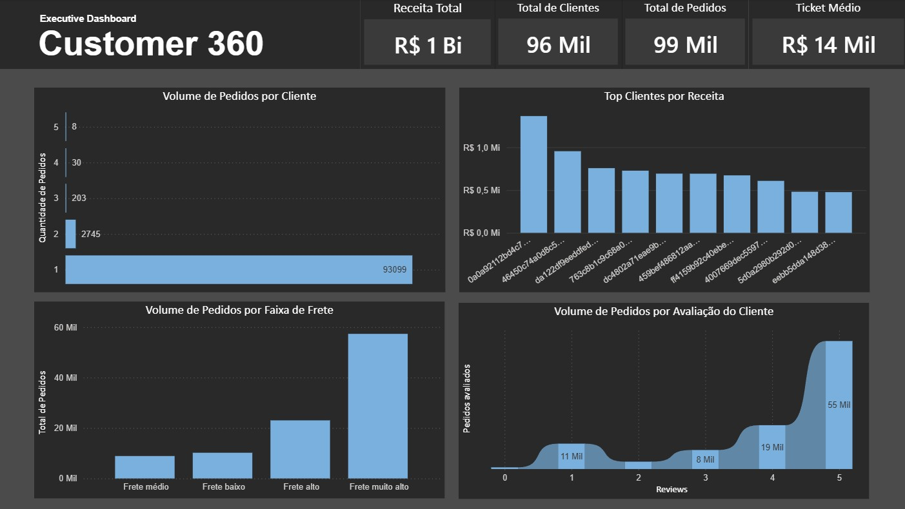

# 📊 Executive Dashboard — Customer 360

## 📌 Visão Geral
Este repositório apresenta um **Dashboard Executivo de Customer 360**, desenvolvido com foco em análise de comportamento do cliente, concentração de receita e experiência de compra, utilizando dados de e-commerce.

O projeto tem como objetivo transformar dados brutos em insights acionáveis, aplicando boas práticas de Data Analytics, Data Storytelling e visualização executiva.

---
## 🧩 Contexto do Projeto

A análise foi construída a partir de uma base pública de e-commerce da Olist, com tratamento e preparação dos dados em Python, e visualização final no Power BI.

O foco do dashboard não é apenas mostrar métricas, mas contar uma história clara sobre o negócio, apoiando decisões estratégicas.

---
## 🎯 Objetivo do Projeto
- Desenvolver um dashboard executivo de Customer 360 a partir de dados de E-commerce.
- Analisar o comportamento de compra dos clientes, considerando frequência e volume de pedidos.
- Identificar a concentração de receita e o impacto de clientes de alto valor no faturamento.
- Avaliar a experiência do cliente, utilizando métricas de avaliação e sua relação com o volume de pedidos.
- Explorar o impacto do frete como possível fator de influência no comportamento de compra.
- Transformar dados tratados em insights claros e acionáveis, com foco em leitura executiva e storytelling.

---
## 📈 Principais Análises e Indicadores

### 1️⃣Frequência de Compra dos Clientes

A análise do **Volume de Pedidos por Cliente** mostra que:

- A maioria dos clientes realiza **apenas 1 a 2 pedidos**
- Existe **baixa recorrência** na base de clientes

**Insight:** o negócio depende mais de aquisição do que de retenção, o que pode elevar custos ao longo do tempo.

---
### 2️⃣ Concentração de Receita

No gráfico **Top Clientes por Receita**, observa-se que:

- Uma pequena parcela de clientes é responsável por uma parte significativa do faturamento
- Clientes de alto valor têm impacto direto no resultado do negócio

**Insight:** o padrão sugere oportunidades para estratégias de fidelização focadas em clientes premium.

---
### 3️⃣ Impacto do Frete no Volume de Pedidos

A análise do **Volume de Pedidos por Faixa de Frete** evidencia que:

- Pedidos com frete mais alto concentram grande parte do volume
- O custo logístico pode representar um gargalo para expansão da base de pedidos

**Insight:** políticas de frete e otimização logística podem influenciar diretamente o comportamento de compra.

---
### 4️⃣ Relação entre Avaliação e Comportamento de Compra

No gráfico **Volume de Pedidos por Avaliação do Cliente**, observa-se que:

- Clientes que compram mais tendem a apresentar avaliações mais altas
- Existe uma relação positiva entre satisfação e recorrência

**Insight:** investir na experiência do cliente pode aumentar a frequência de compra.

---
## 🎯 Conclusão Executiva

O dashboard revela um negócio caracterizado por:

- **Alto ticket médio**
- **Baixa recorrência**
- **Forte dependência de clientes de alto valor**

Os principais pontos de atenção estão relacionados a:
- Estratégias de retenção
- Redução de barreiras logísticas (frete)
- Melhoria contínua da experiência do cliente

Este projeto demonstra a aplicação prática de Customer Analytics, conectando dados a decisões estratégicas por meio de visualização executiva.

---

## 🧩 Estrutura do Dashboard

- **KPIs Executivos (Cards)**
  - Total de clientes (clientes únicos)
  - Total de pedidos
  - Receita total
  - Ticket médio

- **Comportamento de Compra**
  - **Volume de pedidos por cliente** - Demonstra q quantidade de pedidos feita por cada cliente. 
  - **Top clientes por receita**- Clientes que concentram valores mais altos em pedidos.

- **Frete e Impacto no Negócio**
  - **Volume de pedidos por faixa de frete**- Variação do valor de frete pelo volume de pedidos.

- **Experiência do Cliente**
  - **Volume de pedidos por avaliação do cliente**- Relação entre satisfação e recorrência.
---

## 🛠️ Ferramentas Utilizadas

- **Python** (Pandas) — tratamento e preparação dos dados  
- **Power BI** — visualização e storytelling  
- **VS Code** — ambiente de desenvolvimento  

---

## 📚 Principais Aprendizados

- **Modelagem e leitura executiva:** Estruturar um dashboard para responder perguntas de negócio rapidamente, evitando excesso de visuais.
- **Métricas e contexto:** Entender como medidas e agregações afetam a interpretação (colunas vs medidas no Power BI).
- **Qualidade e consistência de dados:** Lidar com valores ausentes e padronizar campos numéricos para evitar visuais quebrados.
- **Tratamento de valores exorbitantes:** Ajustar/normalizar valores para serem exibidos em formato padrão, garantindo legibilidade e confiabilidade visual.
- **Storytelling em BI:** Transformar gráficos em narrativa.
- **Iteração e melhoria:** Testar visuais e manter apenas o que gera insight.
- **Atualização de dados sem quebrar o modelo:** Aprender a atualizar a fonte mantendo colunas/medidas criadas no Power BI e garantindo consistência de nomes e tipos.

---
## 📌 Observações

- Os valores monetários foram escalados para facilitar a visualização, mantendo as proporções originais do dataset.
- O projeto tem fins educacionais e de portfólio.

---
## 📷 Preview do Dashboard

👉 🔗 **[Abrir Dashboard no Power BI]** https://acadcruzeirodosul-my.sharepoint.com/:u:/g/personal/paola_bonfim_cs_cruzeirodosul_edu_br/IQAYKEpcNoCqSoxZ9By53mM1Aavhn2CGEoo5os5lJPhV7DE?e=UaYgEY

---
## 📫 Contato

- 🔗 LinkedIn: https://www.linkedin.com/in/paolalopes/
- 💻 GitHub: https://github.com/paollalopes
- 📧 Email: palopes06@hotmail.com

---

⭐ Se você chegou até aqui, fique à vontade para explorar os projetos e acompanhar minha evolução 🚀
